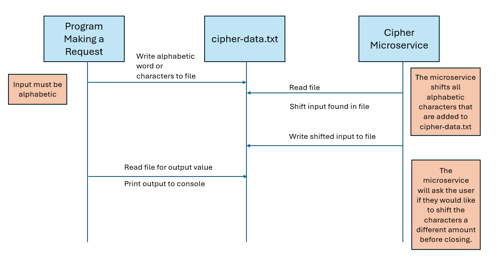

# Cipher Microservice

## Description
This Cipher microservice takes an alphabetic word or character from the `cipher-data.txt` file and shifts each character by a user-designated amount.

The microservice displays the output in the console and writes it back to `cipher-data.txt`.

## Request Data Instructions
1. Write an alphabetic word or string to the `cipher-data.txt` file located in the `cipher` folder.

## Receive Data Instructions
1. Run the cipher microservice and specify how many positions each character should be shifted in the `cipher-data.txt` file.
2. Programmatically read the shifted character string that was written back to the `cipher-data.txt` file.

## UML Sequence Diagram

